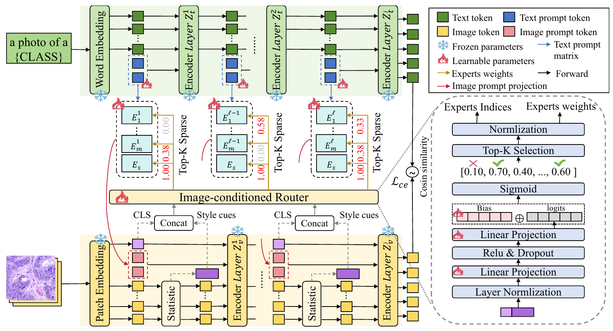

# [NeurIPS 2026!] SaMoE

**Title: Biomedical Acquisition-induced Style Shifts as Mixture Shifts: Style-aware Mixture-of-Experts Multimodal Prompt Learning**

## Overview

Biomedical images vary across acquisition sites, imaging protocols, and modalities. SaMoE adapts a frozen vision-language model with multimodal prompts that respond to these style differences. A shared image-conditioned router combines a small set of prompt experts at each layer, using style statistics from intermediate visual features.

## Method

*Framework overview from Figure 2 of the paper.*

- **Style-aware routing.** Patch means, patch variances, and the global image token form the routing input.
- **Sparse expert composition.** Each layer combines a shared projection with two selected experts from a bank of four.
- **Multi-layer prompting.** Text and visual prompts adapt the first nine transformer layers while the backbone remains frozen.
- **Balanced expert use.** A routing-balance loss regularizes the expert weights alongside the classification objective.

## Supported Settings

| Setting | Configuration | Script | Trainer |
|---|---|---|---|
| Base-to-novel generalization | [base_to_novel.yaml](configs/base_to_novel.yaml) | [base2new.sh](scripts/base2new.sh) | [samoe.py](trainers/samoe.py) |
| Cross-domain generalization | [cross_domain.yaml](configs/cross_domain.yaml) | [cross_domain.sh](scripts/cross_domain.sh) | [samoe.py](trainers/samoe.py) |

## Results

The following are selected results reported in the paper, averaged over three runs. They are not new measurements from this code release.

### Base-to-Novel Generalization

Average accuracy (%) across the 11-dataset benchmark, using CLIP ViT-B/16 and 16 labeled examples per base class. Values are copied from the Average columns of Table 1; HM is reported as in the paper.

| Method | Base | Novel | HM |
|---|---:|---:|---:|
| CLIP | 43.00 | 38.63 | 40.70 |
| CoOp | 62.14 | 40.71 | 49.19 |
| MaPLe | 76.37 | 39.52 | 52.09 |
| PromptSRC | 63.52 | 45.50 | 53.02 |
| BiomedCoOp | 70.84 | 36.07 | 47.80 |
| **SaMoE** | **76.79** | **56.37** | **65.01** |

### Cross-Domain Generalization

Selected target-domain accuracies (%) from Table 2. Models use a 16-shot source support set and are evaluated on the target without target-domain training.

| Protocol | Source | Target | MaPLe | PromptSRC | BiomedCoOp | SaMoE |
|---|---|---|---:|---:|---:|---:|
| Cross-site | DermaMNIST | Derm7pt Clinical | 27.79 | 32.17 | 30.63 | **34.91** |
| Cross-site | DermaMNIST | PH2 | 34.33 | 25.83 | 32.50 | **46.50** |
| Cross-protocol | BTMRI | FLAIR | 55.11 | 44.00 | 51.03 | **58.67** |
| Cross-protocol | BTMRI | T1W-CE | 70.25 | 49.10 | 72.76 | **80.11** |
| Cross-modality | OCTMNIST | Mean of 9 targets | 22.08 | 23.10 | 18.87 | **29.21** |

The cross-modality setting also changes anatomical structures and label spaces; it is a compound domain-shift evaluation.

## Installation

See [INSTALL.md](docs/INSTALL.md) for environment setup and pretrained-model requirements.

## Data Preparation

See [DATASETS.md](docs/DATASETS.md) for the expected directory structure. Select a dataset with `--dataset`; separate dataset YAML files are not required.

## Training and Evaluation

See [RUN.md](docs/RUN.md) for commands covering base-to-novel, cross-site, cross-protocol, and cross-modality evaluation.

The default model uses 8 context tokens, prompt depth 9, four routed experts, Top-2 selection, router width 256, and a balance-loss weight of 0.1. Training uses SGD with learning rate 0.0025 and batch size 4, for 50 epochs in base-to-novel and 100 epochs in cross-domain experiments.

## Citation

## Acknowledgements

Our implementation builds on [BiomedCoOp](https://github.com/HealthX-Lab/BiomedCoOp), [CoOp](https://github.com/KaiyangZhou/CoOp), [MaPLe](https://github.com/muzairkhattak/multimodal-prompt-learning), [CLIP](https://github.com/openai/CLIP), and [Dassl.pytorch](https://github.com/KaiyangZhou/Dassl.pytorch). We thank their authors for making the code publicly available.

## License

This project is released under the [MIT License](LICENSE). See [THIRD_PARTY_NOTICES.md](THIRD_PARTY_NOTICES.md) for the licenses of included dependencies.
